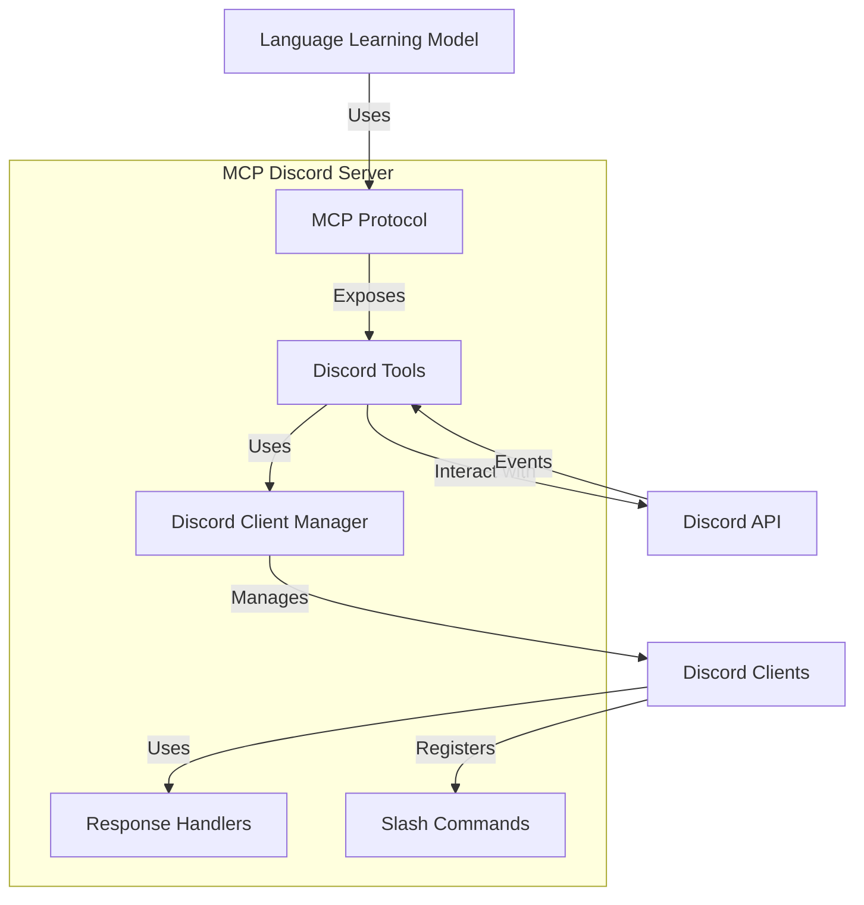

# System Overview

## High-Level Architecture

The MCP Discord server is a Node.js application that provides a bridge between Discord and Language Learning Models (LLMs) using the Model Context Protocol (MCP). The system exposes Discord functionality as MCP tools that can be used by LLMs to interact with Discord.

## Core Components

### FastMCP Server

The core of the system is a FastMCP server that exposes Discord functionality as tools. The server is created using the `@missionsquad/fastmcp` package and provides tools for:

- Sending messages to Discord channels
- Reading messages from Discord channels
- Registering slash commands
- Creating and managing message listeners

### Discord Client Manager

The Discord Client Manager is responsible for:

- Creating and managing Discord.js clients
- Handling authentication with Discord
- Managing message listeners
- Finding guilds and channels
- Cleaning up inactive clients

### Response Handlers

Response handlers define how the bot responds to messages that match keywords in a listener. The system includes:

- A registry for managing response handlers
- Built-in handlers (ack, echo)
- Support for custom handlers

### Slash Commands

The system supports Discord slash commands:

- Defining command data (name, description, options)
- Handling command interactions
- Permission checking
- Error handling

## Data Flow

1. LLMs interact with the MCP Discord server through the MCP protocol
2. The server processes requests and uses Discord.js to interact with Discord
3. Discord events are captured and processed by the appropriate handlers
4. Results are returned to the LLM through the MCP protocol

## Configuration

The system is configured through:

- Environment variables
- Configuration schema validation using Zod
- Default values for optional settings

## Error Handling

The system includes robust error handling:

- Configurable logging levels
- Retry mechanisms with exponential backoff
- Graceful cleanup on process exit

## AI Assistance Notes

- Model Used: Claude
- Prompt: Nexus Onboarding Assistant
- Date Generated: 2025-03-24
